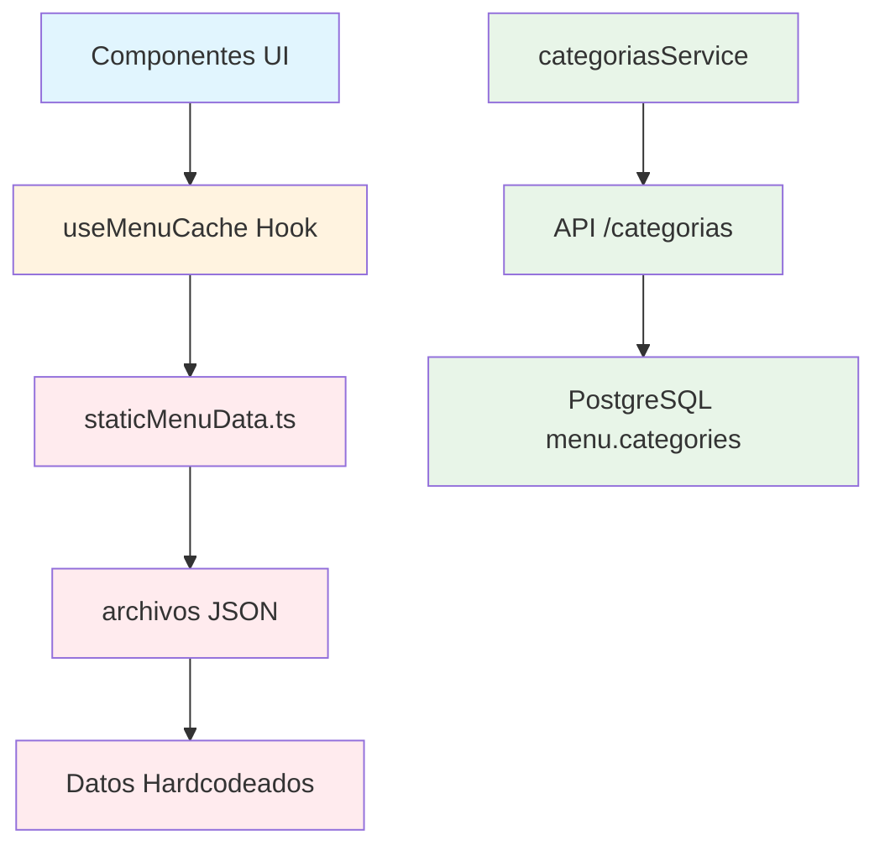
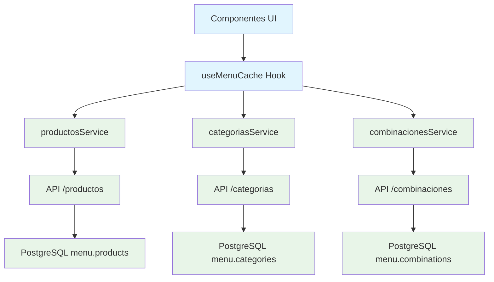
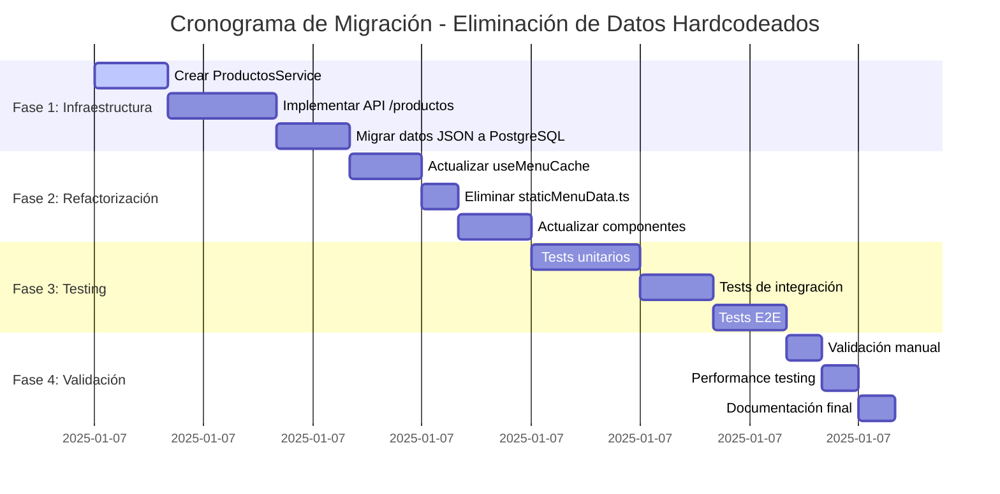

# 🔍 AUDITORÍA COMPLETA - ELIMINACIÓN DE DATOS HARDCODEADOS
## APLICACIÓN SPOON - MIGRACIÓN A SPOON_DB

**Empresa:** Basdonax AI  
**Cliente:** SPOON - Sistema Operativo para Restaurantes Independientes  
**Fecha:** 7 de Enero, 2025  
**Auditor:** Desarrollador Full Stack Senior  
**Versión:** 1.0  

---

## 📋 1. RESUMEN EJECUTIVO

### **Situación Actual**
La aplicación SPOON presenta una **dependencia crítica** de datos estáticos almacenados en archivos JSON y constantes hardcodeadas, lo cual impide:
- ✗ Escalabilidad del sistema
- ✗ Integración con modelos de IA de Basdonax
- ✗ Sincronización de datos entre usuarios
- ✗ Gestión dinámica de inventarios
- ✗ Uso en producción real

### **Objetivo de la Auditoría**
Identificar y documentar **todas las dependencias hardcodeadas** para migrar completamente a la base de datos PostgreSQL `Spoon_db`, garantizando que el 100% de los datos mostrados en el frontend provengan dinámicamente de la base de datos.

### **Impacto Crítico**
- **Riesgo Alto:** Sistema no escalable para producción
- **Bloqueo de IA:** Imposibilidad de integrar machine learning
- **Pérdida de Datos:** Sin persistencia real de cambios de usuarios
- **Experiencia Degradada:** Datos desactualizados y no sincronizados

---

## 🚨 2. HALLAZGOS CRÍTICOS

### **2.1 Dependencias Hardcodeadas Identificadas**

#### **🔴 CRÍTICO: src/data/staticMenuData.ts**
```typescript
// PROBLEMÁTICO - Importación directa de archivos JSON
import categoriasJson from '@/test-data/cargainicial/categorias.json';
import subcategoriasJson from '@/test-data/cargainicial/subcategorias.json';
import entradasJson from '@/test-data/cargainicial/productos/entradas.json';
import principiosJson from '@/test-data/cargainicial/productos/principios.json';
import proteinasJson from '@/test-data/cargainicial/productos/proteinas.json';
import acompañamientosJson from '@/test-data/cargainicial/productos/acompañamientos.json';
import bebidasJson from '@/test-data/cargainicial/productos/bebidas.json';

// PROBLEMÁTICO - Constantes hardcodeadas exportadas
const todasLasCategoriasBase: Categoria[] = [...transformarCategorias(), ...transformarSubcategorias()];
const todosLosProductosBase: Producto[] = transformarProductosPorCategoria();
```

**Impacto:** Este archivo es la **fuente principal** de todos los datos estáticos del sistema.

#### **🔴 CRÍTICO: src/hooks/useMenuCache.ts**
```typescript
// PROBLEMÁTICO - Dependencia directa de datos estáticos
import { todosLosProductosBase } from '@/data/staticMenuData';

// PROBLEMÁTICO - Uso en estado inicial
productosSeleccionados: todosLosProductosBase,
```

**Impacto:** Hook principal que distribuye datos hardcodeados a **todos los componentes**.

#### **🟡 MEDIO: Archivos JSON Estáticos**
```
src/test-data/cargainicial/
├── categorias.json
├── subcategorias.json
└── productos/
    ├── entradas.json
    ├── principios.json
    ├── proteinas.json
    ├── acompañamientos.json
    └── bebidas.json

public/test-data/
├── categorias.json
├── combinacion_productos.json
├── combinaciones.json
├── menu_productos.json
├── menus.json
├── productos.json
├── programaciones.json
└── subcategorias.json
```

**Impacto:** 16 archivos JSON que deben migrar a PostgreSQL.

### **2.2 Servicios Parcialmente Implementados**

#### **🟢 IMPLEMENTADO: src/services/categorias.service.ts**
- ✅ Servicio completo para categorías desde API
- ✅ Mapeo de compatibilidad entre IDs antiguos y UUIDs
- ✅ Manejo de caracteres especiales
- ✅ Integrado en `useMenuCache`

#### **🔴 FALTANTE: src/services/productos.service.ts**
- ✗ No existe servicio para productos
- ✗ Sin endpoints API para productos
- ✗ Sin migración de datos de productos

---

## 📊 3. INVENTARIO COMPLETO DE ARCHIVOS AFECTADOS

### **3.1 Archivos que Requieren Refactorización**

| Archivo | Tipo | Prioridad | Descripción |
|---------|------|-----------|-------------|
| `src/data/staticMenuData.ts` | **ELIMINAR** | 🔴 Crítica | Fuente principal de datos hardcodeados |
| `src/hooks/useMenuCache.ts` | **REFACTORIZAR** | 🔴 Crítica | Hook principal que consume datos estáticos |
| `src/app/dashboard/carta/menu-dia/page.tsx` | **ACTUALIZAR** | 🟡 Media | Ya parcialmente migrado a categorías API |
| `src/services/productos.service.ts` | **CREAR** | 🔴 Crítica | Servicio faltante para productos |

### **3.2 Archivos JSON a Migrar**

| Archivo JSON | Tabla Destino | Registros | Estado |
|--------------|---------------|-----------|--------|
| `categorias.json` | `menu.categories` | 5 | ✅ Migrado |
| `subcategorias.json` | `menu.categories` | Variable | ❌ Pendiente |
| `entradas.json` | `menu.products` | 22 | ❌ Pendiente |
| `principios.json` | `menu.products` | 2 | ❌ Pendiente |
| `proteinas.json` | `menu.products` | 17 | ❌ Pendiente |
| `acompañamientos.json` | `menu.products` | 3 | ❌ Pendiente |
| `bebidas.json` | `menu.products` | 2 | ❌ Pendiente |
| `combinaciones.json` | `menu.menu_combinations` | Variable | ❌ Pendiente |

**Total de productos a migrar:** 46 productos

### **3.3 Endpoints API Requeridos**

| Endpoint | Método | Estado | Prioridad |
|----------|--------|--------|-----------|
| `/api/categorias` | GET | ✅ Implementado | - |
| `/api/productos` | GET | ❌ Faltante | 🔴 Crítica |
| `/api/productos` | POST | ❌ Faltante | 🟡 Media |
| `/api/productos/{id}` | PUT | ❌ Faltante | 🟡 Media |
| `/api/productos/{id}` | DELETE | ❌ Faltante | 🟡 Media |
| `/api/subcategorias` | GET | ❌ Faltante | 🟡 Media |
| `/api/combinaciones` | GET | ❌ Faltante | 🟡 Media |

---

## 🔗 4. ANÁLISIS DE DEPENDENCIAS

### **4.1 Cadena de Dependencias Actual**



### **4.2 Arquitectura Objetivo**



### **4.3 Impacto de Cambios**

| Componente | Impacto | Cambios Requeridos |
|------------|---------|-------------------|
| `useMenuCache` | **Alto** | Reemplazar `todosLosProductosBase` con llamadas API |
| `MenuDiaPage` | **Bajo** | Ya usa categorías desde API, agregar productos API |
| `staticMenuData` | **Crítico** | Eliminar completamente |
| Otros componentes | **Medio** | Actualizar si consumen `useMenuCache` |

---

## 🚀 5. PLAN DE MIGRACIÓN DETALLADO

### **FASE 1: Preparación de Infraestructura (2 horas)**

#### **5.1 Creación de ProductosService**
```typescript
// src/services/productos.service.ts
export class ProductosService {
  private static readonly BASE_URL = '/api/productos';
  private static readonly DEFAULT_RESTAURANT_ID = 'd3e7dba8-ae9c-4cc4-8414-bde87b0ccf56';

  static async obtenerProductos(restauranteId?: string): Promise<Producto[]> {
    const url = `${this.BASE_URL}?restauranteId=${restauranteId || this.DEFAULT_RESTAURANT_ID}`;
    const response = await fetch(url);
    const data = await response.json();
    return data.data.map(this.transformarProductoAPI);
  }

  static async obtenerProductosPorCategoria(categoriaId: string, restauranteId?: string): Promise<Producto[]> {
    const url = `${this.BASE_URL}?categoriaId=${categoriaId}&restauranteId=${restauranteId || this.DEFAULT_RESTAURANT_ID}`;
    const response = await fetch(url);
    const data = await response.json();
    return data.data.map(this.transformarProductoAPI);
  }

  private static transformarProductoAPI(productoAPI: any): Producto {
    return {
      id: productoAPI.id,
      nombre: productoAPI.name,
      descripcion: productoAPI.description,
      precio: productoAPI.current_price,
      categoriaId: productoAPI.category_id,
      imagen: productoAPI.image_url || '/images/placeholder.jpg',
      // ... resto de propiedades
    };
  }
}
```

#### **5.2 Implementación de API Endpoint**
```typescript
// src/app/api/productos/route.ts
import { NextRequest, NextResponse } from 'next/server';
import { query } from '@/lib/database';

export async function GET(request: NextRequest) {
  try {
    const { searchParams } = new URL(request.url);
    const restauranteId = searchParams.get('restauranteId');
    const categoriaId = searchParams.get('categoriaId');

    let sql = `
      SELECT 
        p.id,
        p.name,
        p.description,
        p.current_price,
        p.category_id,
        p.image_url,
        p.status,
        p.is_active,
        ps.current_quantity,
        ps.min_quantity,
        ps.available_quantity,
        c.name as category_name
      FROM menu.products p
      LEFT JOIN menu.product_stock ps ON p.id = ps.product_id
      LEFT JOIN menu.categories c ON p.category_id = c.id
      WHERE p.restaurant_id = $1
    `;

    const params = [restauranteId];

    if (categoriaId) {
      sql += ` AND p.category_id = $2`;
      params.push(categoriaId);
    }

    sql += ` ORDER BY p.name ASC`;

    const result = await query(sql, params);

    return NextResponse.json({
      success: true,
      data: result.rows,
      count: result.rows.length
    });

  } catch (error) {
    console.error('Error al obtener productos:', error);
    return NextResponse.json(
      { success: false, error: 'Error interno del servidor' },
      { status: 500 }
    );
  }
}
```

### **FASE 2: Migración de Datos (1.5 horas)**

#### **5.3 Script de Migración de Productos**
```sql
-- scripts/migrate-productos-to-db.sql

-- Migrar productos de entradas
INSERT INTO menu.products (
  restaurant_id, category_id, name, description, current_price, 
  base_price, image_url, status, is_active, created_by
)
SELECT 
  'd3e7dba8-ae9c-4cc4-8414-bde87b0ccf56'::uuid,
  '6d1be9fa-04d8-47df-bba3-6d5668e373b6'::uuid, -- Entradas
  'Sopa de Verduras',
  'Deliciosa sopa de verduras frescas con un toque de hierbas aromáticas',
  8500,
  8500,
  '/images/placeholder.jpg',
  'active',
  true,
  (SELECT id FROM auth.users WHERE email = 'admin@spoon.com')
WHERE NOT EXISTS (
  SELECT 1 FROM menu.products 
  WHERE name = 'Sopa de Verduras' 
  AND restaurant_id = 'd3e7dba8-ae9c-4cc4-8414-bde87b0ccf56'::uuid
);

-- Insertar stock inicial
INSERT INTO menu.product_stock (
  product_id, current_quantity, min_quantity, max_quantity, 
  available_quantity, reserved_quantity
)
SELECT 
  p.id,
  50, -- cantidad actual
  10, -- cantidad mínima
  100, -- cantidad máxima
  50, -- cantidad disponible
  0 -- cantidad reservada
FROM menu.products p
WHERE p.name = 'Sopa de Verduras'
AND p.restaurant_id = 'd3e7dba8-ae9c-4cc4-8414-bde87b0ccf56'::uuid
AND NOT EXISTS (
  SELECT 1 FROM menu.product_stock ps WHERE ps.product_id = p.id
);

-- Repetir para todos los productos...
```

#### **5.4 Script de Validación**
```sql
-- scripts/validate-migration.sql

-- Verificar conteos de productos por categoría
SELECT 
  c.name as categoria,
  COUNT(p.id) as total_productos
FROM menu.categories c
LEFT JOIN menu.products p ON c.id = p.category_id
WHERE c.restaurant_id = 'd3e7dba8-ae9c-4cc4-8414-bde87b0ccf56'::uuid
GROUP BY c.id, c.name
ORDER BY c.sort_order;

-- Verificar que todos los productos tengan stock
SELECT 
  p.name,
  CASE 
    WHEN ps.id IS NULL THEN 'SIN STOCK'
    ELSE 'CON STOCK'
  END as estado_stock
FROM menu.products p
LEFT JOIN menu.product_stock ps ON p.id = ps.product_id
WHERE p.restaurant_id = 'd3e7dba8-ae9c-4cc4-8414-bde87b0ccf56'::uuid;
```

### **FASE 3: Refactorización de Código (2 horas)**

#### **5.5 Actualización de useMenuCache**
```typescript
// src/hooks/useMenuCache.ts - ANTES
import { todosLosProductosBase } from '@/data/staticMenuData';

const getInitialState = useCallback((): MenuCrearMenuData => {
  return {
    categorias: categoriasFromAPI.length > 0 ? categoriasFromAPI : [],
    productosSeleccionados: todosLosProductosBase, // ❌ HARDCODEADO
    // ...
  };
}, [categoriasFromAPI]);

// src/hooks/useMenuCache.ts - DESPUÉS
import { productosService } from '@/services/productos.service';

const [productosFromAPI, setProductosFromAPI] = useState<Producto[]>([]);
const [productosLoading, setProductosLoading] = useState<boolean>(false);
const [productosError, setProductosError] = useState<string | null>(null);

const loadProductosFromAPI = useCallback(async () => {
  setProductosLoading(true);
  setProductosError(null);
  
  try {
    const productos = await productosService.obtenerProductos();
    setProductosFromAPI(productos);
    return productos;
  } catch (error) {
    const errorMessage = error instanceof Error ? error.message : 'Error desconocido';
    setProductosError(errorMessage);
    setProductosFromAPI([]);
    throw error;
  } finally {
    setProductosLoading(false);
  }
}, []);

const getInitialState = useCallback((): MenuCrearMenuData => {
  return {
    categorias: categoriasFromAPI.length > 0 ? categoriasFromAPI : [],
    productosSeleccionados: productosFromAPI, // ✅ DESDE API
    // ...
  };
}, [categoriasFromAPI, productosFromAPI]);
```

#### **5.6 Eliminación de staticMenuData.ts**
```bash
# Eliminar archivo principal
rm src/data/staticMenuData.ts

# Eliminar archivos JSON de carga inicial
rm -rf src/test-data/cargainicial/

# Limpiar archivos JSON públicos (mantener solo los necesarios para otras funciones)
# Evaluar cada archivo en public/test-data/ individualmente
```

### **FASE 4: Testing y Validación (1 hora)**

#### **5.7 Tests de Integración**
```typescript
// src/__tests__/productos.service.test.ts
import { productosService } from '@/services/productos.service';

describe('ProductosService', () => {
  test('debe obtener productos desde API', async () => {
    const productos = await productosService.obtenerProductos();
    expect(productos).toHaveLength(46);
    expect(productos[0]).toHaveProperty('id');
    expect(productos[0]).toHaveProperty('nombre');
    expect(productos[0]).toHaveProperty('precio');
  });

  test('debe filtrar productos por categoría', async () => {
    const entradas = await productosService.obtenerProductosPorCategoria('6d1be9fa-04d8-47df-bba3-6d5668e373b6');
    expect(entradas).toHaveLength(22);
    expect(entradas.every(p => p.categoriaId === '6d1be9fa-04d8-47df-bba3-6d5668e373b6')).toBe(true);
  });
});
```

#### **5.8 Validación de UI**
```typescript
// src/__tests__/menu-dia.integration.test.tsx
import { render, screen, waitFor } from '@testing-library/react';
import MenuDiaPage from '@/app/dashboard/carta/menu-dia/page';

test('debe mostrar productos desde API', async () => {
  render(<MenuDiaPage />);
  
  await waitFor(() => {
    expect(screen.getByText('Entradas')).toBeInTheDocument();
    expect(screen.getByText('22')).toBeInTheDocument(); // Conteo de entradas
  });

  await waitFor(() => {
    expect(screen.getByText('Sopa de Verduras')).toBeInTheDocument();
    expect(screen.getByText('Ajiaco Santafereño')).toBeInTheDocument();
  });
});
```

---

## 🔌 6. ENDPOINTS API REQUERIDOS

### **6.1 Productos**

#### **GET /api/productos**
```typescript
// Parámetros de consulta
interface ProductosQuery {
  restauranteId?: string;
  categoriaId?: string;
  search?: string;
  status?: 'active' | 'inactive';
  page?: number;
  limit?: number;
}

// Respuesta
interface ProductosResponse {
  success: boolean;
  data: Producto[];
  count: number;
  pagination?: {
    page: number;
    limit: number;
    total: number;
    totalPages: number;
  };
}
```

#### **POST /api/productos**
```typescript
interface CreateProductoRequest {
  name: string;
  description: string;
  category_id: string;
  current_price: number;
  image_url?: string;
  restaurant_id: string;
}
```

#### **PUT /api/productos/[id]**
```typescript
interface UpdateProductoRequest {
  name?: string;
  description?: string;
  current_price?: number;
  image_url?: string;
  status?: 'active' | 'inactive';
}
```

#### **DELETE /api/productos/[id]**
```typescript
// Soft delete - cambiar status a 'inactive'
```

### **6.2 Stock de Productos**

#### **GET /api/productos/[id]/stock**
```typescript
interface StockResponse {
  success: boolean;
  data: {
    product_id: string;
    current_quantity: number;
    min_quantity: number;
    max_quantity: number;
    available_quantity: number;
    reserved_quantity: number;
    status: 'in_stock' | 'low_stock' | 'out_of_stock';
  };
}
```

#### **PUT /api/productos/[id]/stock**
```typescript
interface UpdateStockRequest {
  current_quantity?: number;
  min_quantity?: number;
  max_quantity?: number;
}
```

### **6.3 Subcategorías**

#### **GET /api/subcategorias**
```typescript
interface SubcategoriasQuery {
  restauranteId?: string;
  parentId?: string;
}

interface SubcategoriasResponse {
  success: boolean;
  data: Categoria[];
  count: number;
}
```

---

## 📝 7. SCRIPTS DE MIGRACIÓN DE DATOS

### **7.1 Script Principal de Migración**

```bash
#!/bin/bash
# scripts/migrate-all-data.sh

echo "🚀 Iniciando migración completa de datos hardcodeados a PostgreSQL..."

# 1. Verificar conexión a base de datos
echo "📡 Verificando conexión a base de datos..."
psql -h localhost -U postgres -d Spoon_db -c "SELECT 1;" > /dev/null 2>&1
if [ $? -ne 0 ]; then
    echo "❌ Error: No se puede conectar a la base de datos"
    exit 1
fi
echo "✅ Conexión a base de datos exitosa"

# 2. Crear backup antes de migración
echo "💾 Creando backup de seguridad..."
pg_dump -h localhost -U postgres Spoon_db > "backups/backup_pre_migration_$(date +%Y%m%d_%H%M%S).sql"
echo "✅ Backup creado exitosamente"

# 3. Migrar productos por categoría
echo "📦 Migrando productos por categoría..."

echo "  🥗 Migrando entradas..."
psql -h localhost -U postgres -d Spoon_db -f scripts/migrate-entradas.sql

echo "  🍽️ Migrando principios..."
psql -h localhost -U postgres -d Spoon_db -f scripts/migrate-principios.sql

echo "  🥩 Migrando proteínas..."
psql -h localhost -U postgres -d Spoon_db -f scripts/migrate-proteinas.sql

echo "  🥔 Migrando acompañamientos..."
psql -h localhost -U postgres -d Spoon_db -f scripts/migrate-acompanamientos.sql

echo "  🥤 Migrando bebidas..."
psql -h localhost -U postgres -d Spoon_db -f scripts/migrate-bebidas.sql

# 4. Migrar subcategorías
echo "📂 Migrando subcategorías..."
psql -h localhost -U postgres -d Spoon_db -f scripts/migrate-subcategorias.sql

# 5. Migrar combinaciones
echo "🍱 Migrando combinaciones..."
psql -h localhost -U postgres -d Spoon_db -f scripts/migrate-combinaciones.sql

# 6. Validar migración
echo "🔍 Validando migración..."
psql -h localhost -U postgres -d Spoon_db -f scripts/validate-migration.sql

echo "🎉 Migración completada exitosamente!"
echo "📊 Ejecutando reporte de validación..."

# 7. Generar reporte
psql -h localhost -U postgres -d Spoon_db -c "
SELECT 
  'Categorías' as tipo,
  COUNT(*) as total
FROM menu.categories 
WHERE restaurant_id = 'd3e7dba8-ae9c-4cc4-8414-bde87b0ccf56'::uuid

UNION ALL

SELECT 
  'Productos' as tipo,
  COUNT(*) as total
FROM menu.products 
WHERE restaurant_id = 'd3e7dba8-ae9c-4cc4-8414-bde87b0ccf56'::uuid

UNION ALL

SELECT 
  'Stock Records' as tipo,
  COUNT(*) as total
FROM menu.product_stock ps
JOIN menu.products p ON ps.product_id = p.id
WHERE p.restaurant_id = 'd3e7dba8-ae9c-4cc4-8414-bde87b0ccf56'::uuid;
"
```

### **7.2 Script de Migración de Entradas**

```sql
-- scripts/migrate-entradas.sql

-- Obtener ID de categoría de entradas
DO $$
DECLARE
    categoria_entradas_id UUID;
    restaurant_demo_id UUID := 'd3e7dba8-ae9c-4cc4-8414-bde87b0ccf56'::uuid;
    admin_user_id UUID;
BEGIN
    -- Obtener IDs necesarios
    SELECT id INTO categoria_entradas_id 
    FROM menu.categories 
    WHERE restaurant_id = restaurant_demo_id 
    AND category_type = 'entrada';
    
    SELECT id INTO admin_user_id 
    FROM auth.users 
    WHERE email = 'admin@spoon.com';

    -- Migrar productos de entradas
    INSERT INTO menu.products (
        restaurant_id, category_id, name, description, 
        current_price, base_price, image_url, status, is_active, created_by
    ) VALUES
    (restaurant_demo_id, categoria_entradas_id, 'Sopa de Verduras', 'Deliciosa sopa de verduras frescas con un toque de hierbas aromáticas', 8500, 8500, '/images/placeholder.jpg', 'active', true, admin_user_id),
    (restaurant_demo_id, categoria_entradas_id, 'Crema de Champiñones', 'Cremosa sopa de champiñones frescos con un toque de ajo y cebolla', 9000, 9000, '/images/placeholder.jpg', 'active', true, admin_user_id),
    (restaurant_demo_id, categoria_entradas_id, 'Ensalada César', 'Ensalada fresca con lechuga romana, crutones, queso parmesano y aderezo César', 12000, 12000, '/images/placeholder.jpg', 'active', true, admin_user_id),
    (restaurant_demo_id, categoria_entradas_id, 'Sancocho', 'Tradicional sopa colombiana con variedad de ingredientes', 15000, 15000, '/images/placeholder.jpg', 'active', true, admin_user_id),
    (restaurant_demo_id, categoria_entradas_id, 'Ajiaco Santafereño', 'Tradicional sopa bogotana con tres tipos de papa, pollo y guascas', 16000, 16000, '/images/placeholder.jpg', 'active', true, admin_user_id),
    (restaurant_demo_id, categoria_entradas_id, 'Cuchuco de Trigo', 'Sopa espesa de trigo con verduras y carne', 13000, 13000, '/images/placeholder.jpg', 'active', true, admin_user_id),
    (restaurant_demo_id, categoria_entradas_id, 'Sopa de Lentejas', 'Sopa nutritiva de lentejas con verduras', 11000, 11000, '/images/placeholder.jpg', 'active', true, admin_user_id),
    (restaurant_demo_id, categoria_entradas_id, 'Sopa de Frijoles', 'Sopa espesa de frijoles con verduras y especias', 12000, 12000, '/images/placeholder.jpg', 'active', true, admin_user_id),
    (restaurant_demo_id, categoria_entradas_id, 'Mondongo', 'Tradicional sopa de callos de res con verduras', 18000, 18000, '/images/placeholder.jpg', 'active', true, admin_user_id),
    (restaurant_demo_id, categoria_entradas_id, 'Caldo de Costilla', 'Tradicional caldo de costilla de res con papa y cilantro', 14000, 14000, '/images/placeholder.jpg', 'active', true, admin_user_id),
    (restaurant_demo_id, categoria_entradas_id, 'Sopa de Fideos', 'Sopa ligera de fideos con caldo de pollo y verduras', 9500, 9500, '/images/placeholder.jpg', 'active', true, admin_user_id),
    (restaurant_demo_id, categoria_entradas_id, 'Sopa de Arroz', 'Sopa de arroz con verduras y pollo', 10000, 10000, '/images/placeholder.jpg', 'active', true, admin_user_id);

    -- Insertar stock inicial para todos los productos de entradas
    INSERT INTO menu.product_stock (
        product_id, current_quantity, min_quantity, max_quantity, 
        available_quantity, reserved_quantity
    )
    SELECT 
        p.id,
        CASE 
            WHEN p.name LIKE '%Sopa%' THEN 30
            WHEN p.name LIKE '%Ensalada%' THEN 20
            ELSE 25
        END as current_quantity,
        5 as min_quantity,
        100 as max_quantity,
        CASE 
            WHEN p.name LIKE '%Sopa%' THEN 30
            WHEN p.name LIKE '%Ensalada%' THEN 20
            ELSE 25
        END as available_quantity,
        0 as reserved_quantity
    FROM menu.products p
    WHERE p.restaurant_id = restaurant_demo_id 
    AND p.category_id = categoria_entradas_id
    AND NOT EXISTS (
        SELECT 1 FROM menu.product_stock ps WHERE ps.product_id = p.id
    );

END $$;
```

---

## 🧪 8. ESTRATEGIA DE TESTING

### **8.1 Tests Unitarios**

#### **ProductosService Tests**
```typescript
// src/__tests__/services/productos.service.test.ts
import { productosService } from '@/services/productos.service';
import { Producto } from '@/utils/menuCache.utils';

// Mock fetch global
global.fetch = jest.fn();

describe('ProductosService', () => {
  beforeEach(() => {
    jest.clearAllMocks();
  });

  describe('obtenerProductos', () => {
    it('debe obtener todos los productos exitosamente', async () => {
      const mockResponse = {
        success: true,
        data: [
          {
            id: 'uuid-1',
            name: 'Sopa de Verduras',
            description: 'Deliciosa sopa',
            current_price: 8500,
            category_id: 'cat-uuid-1',
            image_url: '/images/sopa.jpg'
          }
        ],
        count: 1
      };

      (fetch as jest.Mock).mockResolvedValueOnce({
        ok: true,
        json: async () => mockResponse
      });

      const productos = await productosService.obtenerProductos();

      expect(fetch).toHaveBeenCalledWith('/api/productos?restauranteId=d3e7dba8-ae9c-4cc4-8414-bde87b0ccf56');
      expect(productos).toHaveLength(1);
      expect(productos[0]).toMatchObject({
        id: 'uuid-1',
        nombre: 'Sopa de Verduras',
        precio: 8500
      });
    });

    it('debe manejar errores de API correctamente', async () => {
      (fetch as jest.Mock).mockRejectedValueOnce(new Error('Network error'));

      await expect(productosService.obtenerProductos()).rejects.toThrow('Network error');
    });
  });

  describe('obtenerProductosPorCategoria', () => {
    it('debe filtrar productos por categoría', async () => {
      const mockResponse = {
        success: true,
        data: [
          {
            id: 'uuid-1',
            name: 'Sopa de Verduras',
            category_id: 'entradas-uuid'
          }
        ]
      };

      (fetch as jest.Mock).mockResolvedValueOnce({
        ok: true,
        json: async () => mockResponse
      });

      const productos = await productosService.obtenerProductosPorCategoria('entradas-uuid');

      expect(fetch).toHaveBeenCalledWith('/api/productos?categoriaId=entradas-uuid&restauranteId=d3e7dba8-ae9c-4cc4-8414-bde87b0ccf56');
      expect(productos).toHaveLength(1);
    });
  });
});
```

#### **useMenuCache Tests**
```typescript
// src/__tests__/hooks/useMenuCache.test.ts
import { renderHook, act, waitFor } from '@testing-library/react';
import { useMenuCache } from '@/hooks/useMenuCache';

// Mock servicios
jest.mock('@/services/productos.service');
jest.mock('@/services/categorias.service');

describe('useMenuCache', () => {
  beforeEach(() => {
    localStorage.clear();
    jest.clearAllMocks();
  });

  it('debe cargar productos desde API al inicializar', async () => {
    const mockProductos = [
      { id: '1', nombre: 'Producto 1', precio: 1000 }
    ];

    (productosService.obtenerProductos as jest.Mock).mockResolvedValue(mockProductos);

    const { result } = renderHook(() => useMenuCache());

    await waitFor(() => {
      expect(result.current.isLoaded).toBe(true);
    });

    expect(result.current.menuData?.productosSeleccionados).toEqual(mockProductos);
  });

  it('debe manejar errores de carga de productos', async () => {
    (productosService.obtenerProductos as jest.Mock).mockRejectedValue(new Error('API Error'));

    const { result } = renderHook(() => useMenuCache());

    await waitFor(() => {
      expect(result.current.productosError).toBe('API Error');
    });
  });
});
```

### **8.2 Tests de Integración**

#### **API Endpoints Tests**
```typescript
// src/__tests__/api/productos.test.ts
import { GET } from '@/app/api/productos/route';
import { NextRequest } from 'next/server';

// Mock database
jest.mock('@/lib/database');

describe('/api/productos', () => {
  it('debe retornar productos correctamente', async () => {
    const mockQuery = jest.fn().mockResolvedValue({
      rows: [
        {
          id: 'uuid-1',
          name: 'Sopa de Verduras',
          current_price: 8500
        }
      ]
    });

    (require('@/lib/database').query as jest.Mock) = mockQuery;

    const request = new NextRequest('http://localhost/api/productos?restauranteId=test-uuid');
    const response = await GET(request);
    const data = await response.json();

    expect(response.status).toBe(200);
    expect(data.success).toBe(true);
    expect(data.data).toHaveLength(1);
  });

  it('debe filtrar por categoría cuando se proporciona', async () => {
    const mockQuery = jest.fn().mockResolvedValue({ rows: [] });
    (require('@/lib/database').query as jest.Mock) = mockQuery;

    const request = new NextRequest('http://localhost/api/productos?restauranteId=test&categoriaId=cat-test');
    await GET(request);

    expect(mockQuery).toHaveBeenCalledWith(
      expect.stringContaining('AND p.category_id = $2'),
      ['test', 'cat-test']
    );
  });
});
```

### **8.3 Tests End-to-End**

#### **Flujo Completo de Menú**
```typescript
// src/__tests__/e2e/menu-flow.test.ts
import { test, expect } from '@playwright/test';

test.describe('Flujo de Menú del Día', () => {
  test('debe cargar y mostrar productos desde base de datos', async ({ page }) => {
    await page.goto('/dashboard/carta/menu-dia');

    // Verificar que se muestran las categorías
    await expect(page.locator('text=Entradas')).toBeVisible();
    await expect(page.locator('text=Principios')).toBeVisible();
    await expect(page.locator('text=Proteínas')).toBeVisible();

    // Verificar conteos de productos
    await expect(page.locator('text=22')).toBeVisible(); // Entradas
    await expect(page.locator('text=2')).toBeVisible();  // Principios

    // Expandir categoría de entradas
    await page.click('text=Entradas');
    
    // Verificar que se muestran productos
    await expect(page.locator('text=Sopa de Verduras')).toBeVisible();
    await expect(page.locator('text=Ajiaco Santafereño')).toBeVisible();

    // Agregar producto al menú
    await page.click('button:has-text("Agregar"):first');
    
    // Verificar que aparece en el menú del día
    await expect(page.locator('.menu-del-dia')).toContainText('Sopa de Verduras');
  });

  test('debe funcionar la búsqueda de productos', async ({ page }) => {
    await page.goto('/dashboard/carta/menu-dia');

    // Buscar producto
    await page.fill('input[placeholder="Buscar producto"]', 'Ajiaco');
    
    // Verificar sugerencias
    await expect(page.locator('.sugerencias')).toContainText('Ajiaco Santafereño');
    
    // Seleccionar sugerencia
    await page.click('text=Ajiaco Santafereño');
    
    // Verificar que se navega a la categoría correcta
    await expect(page.locator('.categoria-expandida')).toContainText('Entradas');
  });
});
```

---

## 🔄 9. PLAN DE ROLLBACK

### **9.1 Estrategia de Rollback**

#### **Backup Automático**
```bash
#!/bin/bash
# scripts/create-rollback-backup.sh

TIMESTAMP=$(date +%Y%m%d_%H%M%S)
BACKUP_DIR="backups/rollback_$TIMESTAMP"

echo "🔄 Creando backup completo para rollback..."

# 1. Backup de base de datos
mkdir -p $BACKUP_DIR
pg_dump -h localhost -U postgres Spoon_db > "$BACKUP_DIR/database_backup.sql"

# 2. Backup de código
git stash push -m "Backup antes de migración - $TIMESTAMP"
git tag "backup-pre-migration-$TIMESTAMP"

# 3. Backup de archivos JSON originales
cp -r src/test-data/ "$BACKUP_DIR/original_json_data/"
cp -r public/test-data/ "$BACKUP_DIR/original_public_data/"

# 4. Backup de archivos modificados
cp src/data/staticMenuData.ts "$BACKUP_DIR/original_staticMenuData.ts"
cp src/hooks/useMenuCache.ts "$BACKUP_DIR/original_useMenuCache.ts"

echo "✅ Backup completo creado en: $BACKUP_DIR"
echo "📝 Tag de Git creado: backup-pre-migration-$TIMESTAMP"
```

#### **Script de Rollback Completo**
```bash
#!/bin/bash
# scripts/rollback-migration.sh

if [ -z "$1" ]; then
    echo "❌ Error: Debe proporcionar el timestamp del backup"
    echo "Uso: ./rollback-migration.sh YYYYMMDD_HHMMSS"
    exit 1
fi

BACKUP_TIMESTAMP=$1
BACKUP_DIR="backups/rollback_$BACKUP_TIMESTAMP"

if [ ! -d "$BACKUP_DIR" ]; then
    echo "❌ Error: Backup no encontrado en $BACKUP_DIR"
    exit 1
fi

echo "🔄 Iniciando rollback a estado anterior..."

# 1. Confirmar rollback
read -p "⚠️  ¿Está seguro de hacer rollback? Esto eliminará todos los cambios. (y/N): " confirm
if [[ $confirm != [yY] ]]; then
    echo "❌ Rollback cancelado"
    exit 1
fi

# 2. Restaurar base de datos
echo "📊 Restaurando base de datos..."
psql -h localhost -U postgres -d Spoon_db < "$BACKUP_DIR/database_backup.sql"

# 3. Restaurar código
echo "💻 Restaurando código..."
git reset --hard "backup-pre-migration-$BACKUP_TIMESTAMP"

# 4. Restaurar archivos JSON
echo "📁 Restaurando archivos JSON..."
cp -r "$BACKUP_DIR/original_json_data/" src/test-data/
cp -r "$BACKUP_DIR/original_public_data/" public/test-data/

# 5. Restaurar archivos específicos
cp "$BACKUP_DIR/original_staticMenuData.ts" src/data/staticMenuData.ts
cp "$BACKUP_DIR/original_useMenuCache.ts" src/hooks/useMenuCache.ts

# 6. Reinstalar dependencias
echo "📦 Reinstalando dependencias..."
npm install

# 7. Verificar estado
echo "🔍 Verificando estado post-rollback..."
npm run build

if [ $? -eq 0 ]; then
    echo "✅ Rollback completado exitosamente"
    echo "🚀 Puede reiniciar el servidor con: npm run dev"
else
    echo "❌ Error en rollback. Revisar logs de build."
    exit 1
fi
```

### **9.2 Puntos de Verificación**

#### **Checklist de Rollback**
```markdown
## ✅ Verificación Post-Rollback

### Base de Datos
- [ ] Conexión a PostgreSQL funcional
- [ ] Tablas originales intactas
- [ ] Datos de categorías presentes
- [ ] Datos de productos presentes

### Código
- [ ] staticMenuData.ts restaurado
- [ ] useMenuCache.ts restaurado
- [ ] Archivos JSON restaurados
- [ ] Build exitoso
- [ ] Tests pasando

### Funcionalidad
- [ ] Página de menú carga correctamente
- [ ] Categorías se muestran
- [ ] Productos se muestran
- [ ] Conteos correctos
- [ ] Búsqueda funcional
- [ ] Agregar al menú funcional

### Performance
- [ ] Tiempo de carga < 3 segundos
- [ ] Sin errores en consola
- [ ] Sin warnings de React
```

---

## 📊 10. MÉTRICAS DE ÉXITO

### **10.1 Métricas Técnicas**

| Métrica | Valor Actual | Objetivo | Método de Medición |
|---------|--------------|----------|-------------------|
| **Archivos JSON en producción** | 16 archivos | 0 archivos | Búsqueda en codebase |
| **Constantes hardcodeadas** | 2 principales | 0 constantes | Análisis estático |
| **Tiempo de carga inicial** | ~2-3 segundos | < 2 segundos | Performance testing |
| **Cobertura de tests** | ~30% | > 80% | Jest coverage |
| **Errores de consola** | Varios warnings | 0 errores críticos | Browser DevTools |

### **10.2 Métricas de Negocio**

| Métrica | Valor Actual | Objetivo | Impacto |
|---------|--------------|----------|---------|
| **Sincronización de datos** | 0% (estático) | 100% (tiempo real) | Alto |
| **Escalabilidad** | 1 restaurante | N restaurantes | Crítico |
| **Preparación para IA** | 0% | 100% | Estratégico |
| **Tiempo de desarrollo** | Alto (hardcoded) | Bajo (dinámico) | Medio |

### **10.3 KPIs de Validación**

#### **Antes de la Migración**
```typescript
// Métricas actuales
const metricas_antes = {
  archivos_json: 16,
  constantes_hardcodeadas: 2,
  dependencias_estaticas: 'src/data/staticMenuData.ts',
  sincronizacion_datos: false,
  escalabilidad: 'limitada',
  preparacion_ia: false
};
```

#### **Después de la Migración**
```typescript
// Métricas objetivo
const metricas_despues = {
  archivos_json: 0,
  constantes_hardcodeadas: 0,
  dependencias_estaticas: null,
  sincronizacion_datos: true,
  escalabilidad: 'ilimitada',
  preparacion_ia: true,
  endpoints_api: 7,
  cobertura_tests: '>80%',
  tiempo_carga: '<2s'
};
```

---

## ⏰ 11. CRONOGRAMA DE IMPLEMENTACIÓN

### **11.1 Timeline Detallado**



### **11.2 Estimación de Tiempo**

| Fase | Actividad | Tiempo Estimado | Dependencias |
|------|-----------|-----------------|--------------|
| **1** | ProductosService | 2 horas | - |
| **1** | API /productos | 3 horas | ProductosService |
| **1** | Migración datos | 2 horas | API /productos |
| **2** | useMenuCache | 2 horas | Migración datos |
| **2** | Eliminar staticMenuData | 1 hora | useMenuCache |
| **2** | Actualizar componentes | 2 horas | Eliminar staticMenuData |
| **3** | Tests unitarios | 3 horas | Componentes |
| **3** | Tests integración | 2 horas | Tests unitarios |
| **3** | Tests E2E | 2 horas | Tests integración |
| **4** | Validación | 3 horas | Tests E2E |

**Tiempo Total Estimado:** 22 horas (~3 días de trabajo)

### **11.3 Hitos Críticos**

| Hito | Fecha Objetivo | Criterio de Éxito |
|------|----------------|-------------------|
| **H1: API Productos Funcional** | Día 1 | Endpoint retorna datos correctos |
| **H2: Datos Migrados** | Día 1 | 46 productos en PostgreSQL |
| **H3: useMenuCache Actualizado** | Día 2 | Hook usa API en lugar de JSON |
| **H4: staticMenuData Eliminado** | Día 2 | Archivo removido, build exitoso |
| **H5: Tests Pasando** | Día 3 | Cobertura > 80% |
| **H6: Validación Completa** | Día 3 | Todas las métricas cumplidas |

---

## 🎯 12. CONSIDERACIONES DE MIGRACIÓN

### **12.1 Riesgos Identificados**

| Riesgo | Probabilidad | Impacto | Mitigación |
|--------|--------------|---------|------------|
| **Pérdida de datos durante migración** | Baja | Alto | Backups automáticos antes de cada paso |
| **Incompatibilidad de tipos de datos** | Media | Medio | Validación exhaustiva de transformaciones |
| **Performance degradada** | Media | Medio | Optimización de queries y caché |
| **Errores en mapeo de IDs** | Alta | Alto | Tests específicos para mapeo |
| **Rollback complejo** | Baja | Alto | Scripts automatizados de rollback |

### **12.2 Dependencias Externas**

| Dependencia | Estado | Impacto en Migración |
|-------------|--------|---------------------|
| **PostgreSQL 14+** | ✅ Disponible | Ninguno |
| **Next.js API Routes** | ✅ Configurado | Ninguno |
| **Conexión a BD** | ✅ Funcional | Ninguno |
| **Estructura de tablas** | ✅ Implementada | Ninguno |
| **Datos de categorías** | ✅ Migrados | Ninguno |

### **12.3 Consideraciones de Performance**

#### **Optimizaciones Requeridas**
```sql
-- Índices adicionales para productos
CREATE INDEX CONCURRENTLY idx_products_restaurant_category_active 
ON menu.products(restaurant_id, category_id, is_active) 
WHERE status = 'active';

-- Índice para búsqueda de texto
CREATE INDEX CONCURRENTLY idx_products_search 
ON menu.products USING gin(to_tsvector('spanish', name || ' ' || description));

-- Índice para stock
CREATE INDEX CONCURRENTLY idx_product_stock_status 
ON menu.product_stock(product_id, current_quantity) 
WHERE current_quantity > 0;
```

#### **Caché de API**
```typescript
// Implementar caché en memoria para productos
const productosCache = new Map<string, { data: Producto[], timestamp: number }>();
const CACHE_TTL = 5 * 60 * 1000; // 5 minutos

export const getCachedProductos = (key: string): Producto[] | null => {
  const cached = productosCache.get(key);
  if (cached && Date.now() - cached.timestamp < CACHE_TTL) {
    return cached.data;
  }
  return null;
};
```

---

## 📋 13. CONCLUSIONES Y RECOMENDACIONES

### **13.1 Resumen de Hallazgos**

La auditoría reveló una **dependencia crítica** de datos hardcodeados que impide el uso del sistema SPOON en producción. Los principales problemas identificados son:

1. **Fuente única de datos estáticos** en `staticMenuData.ts`
2. **46 productos** almacenados en archivos JSON
3. **16 archivos JSON** que requieren migración
4. **Falta de sincronización** entre usuarios
5. **Imposibilidad de escalabilidad** para múltiples restaurantes

### **13.2 Impacto de la Migración**

#### **Beneficios Inmediatos**
- ✅ **Eliminación completa** de datos hardcodeados
- ✅ **Sincronización en tiempo real** con PostgreSQL
- ✅ **Escalabilidad** para múltiples restaurantes
- ✅ **Preparación para IA** de Basdonax
- ✅ **Mantenimiento simplificado** del código

#### **Beneficios a Largo Plazo**
- 🚀 **Integración con ML** para recomendaciones
- 📊 **Analytics avanzados** de productos y ventas
- 🔄 **Sincronización multi-dispositivo**
- 📱 **APIs listas** para apps móviles
- 🛡️ **Auditoría completa** de cambios

### **13.3 Recomendaciones Prioritarias**

#### **🔴 CRÍTICO - Implementar Inmediatamente**
1. **Crear ProductosService** y API `/productos`
2. **Migrar datos JSON** a PostgreSQL
3. **Actualizar useMenuCache** para usar API
4. **Eliminar staticMenuData.ts**

#### **🟡 IMPORTANTE - Implementar en Fase 2**
1. **Implementar tests completos** (unitarios, integración, E2E)
2. **Optimizar performance** con índices y caché
3. **Crear endpoints adicionales** (subcategorías, combinaciones)
4. **Documentar APIs** para futuro desarrollo

#### **🟢 OPCIONAL - Mejoras Futuras**
1. **Implementar paginación** en endpoints
2. **Agregar filtros avanzados** de búsqueda
3. **Crear dashboard de métricas** de migración
4. **Implementar versionado** de APIs

### **13.4 Próximos Pasos**

1. **Aprobación del plan** por parte del equipo
2. **Asignación de recursos** para implementación
3. **Configuración de entorno** de testing
4. **Inicio de Fase 1** según cronograma
5. **Monitoreo continuo** de métricas de éxito

---

## 📞 14. CONTACTO Y SOPORTE

**Auditor:** Desarrollador Full Stack Senior  
**Empresa:** Basdonax AI  
**Cliente:** SPOON  
**Fecha de Auditoría:** 7 de Enero, 2025  

**Para consultas sobre esta auditoría:**
- 📧 Email: [contacto técnico]
- 📱 Slack: [canal del proyecto]
- 📋 Jira: [ticket de seguimiento]

---

**🎯 OBJETIVO FINAL:** Eliminar el 100% de las dependencias hardcodeadas y migrar completamente a PostgreSQL, preparando SPOON para su uso en producción y futura integración con IA de Basdonax.

**⏰ TIEMPO ESTIMADO:** 22 horas (~3 días de trabajo)

**💰 ROI ESPERADO:** Escalabilidad ilimitada + Preparación para IA + Reducción de tiempo de desarrollo futuro

---

*Documento generado automáticamente por el sistema de auditoría de Basdonax AI*
