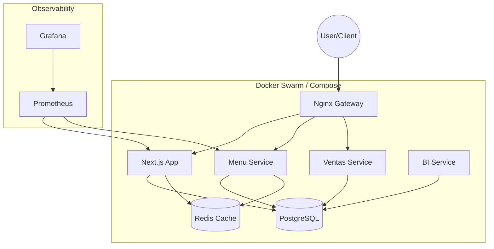

# SPOON System Overview

## 🏗️ Architecture Philosophy
SPOON operates on a **Hybrid Citadel Architecture**:
*   **Core Monolith (Next.js)**: Handles Authentication, UI Rendering, and direct Database interactions for critical paths.
*   **Satellite Microservices**: Specialized Node.js services handle specific domains (Sales, Menu Intelligence, BI) to allow independent scaling and complex logic isolation.
*   **Unified Data Layer**: A single, robust PostgreSQL instance acts as the source of truth, structured with domain-specific schemas (`auth`, `restaurant`, `menu`, `sales`).

---

## 🧩 System Components

### 1. The Gateway (Nginx)
Acting as the unified entry point (Reverse Proxy), Nginx routes traffic based on URL patterns:
*   `/` -> **Next.js Container** (Frontend & BFF)
*   `/api/menu-service/*` -> **Menu Service**
*   `/api/ventas/*` -> **Ventas Service**
*   `/api/bi/*` -> **BI Service**

### 2. The Core (Next.js 14)
*   **Role**: Frontend UI + Backend-for-Frontend (BFF).
*   **Responsibilities**:
    *   **Auth**: Direct interaction with `auth` schema in Postgres.
    *   **Menu Management**: UI for creating menus (Logic shared with Menu Service).
    *   **Dashboarding**: Aggregates data for display.
*   **Tech**: TypeScript, Tailwind, Shadcn UI, Zustand.

### 3. Microservices Ecosystem
| Service | Port | Responsibility | Data Access |
| :--- | :--- | :--- | :--- |
| **Menu Service** | `3001` | Product catalog, Inventory logic. | `menu` schema, Redis |
| **Ventas Service** | `3003` | Order processing, Live sales tracking. | `sales` schema |
| **BI Service** | `3005` | Analytics aggregation, generating reports. | Read-only access to all schemas |

### 4. Data & Persistence
*   **PostgreSQL 14**: The central brain. Uses **Schemas** to enforce separation of concerns within a single physical DB.
*   **Redis**: High-speed caching layer for:
    *   Session storage.
    *   Public Menu data (to reduce DB load on high-traffic consumer apps).

---

## 🔄 Infrastructure Overview
The system runs strictly containerized via Docker Compose.

